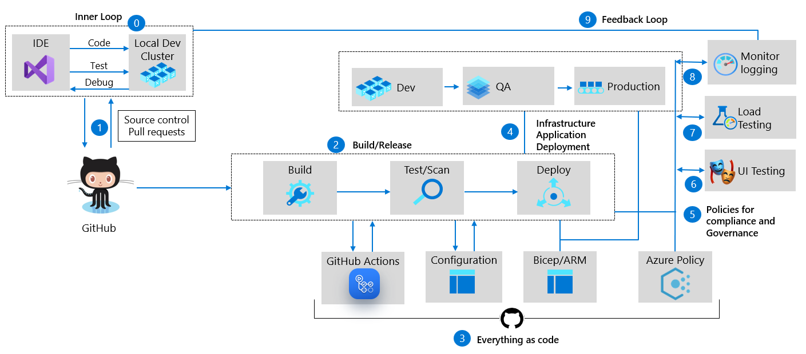

# Mercury Health

## Introduction
The mission of Mercury Health is to help improve longevity and quality of life through healthy activity. The Mercury Health development team has embraced a DevOps approach and is using continuous integration for builds and unit tests. If everything passes they use continuous deployment that deploys to various environments.  Then UI Automation tests are run to ensure usability and key functionally works as designed.  Lastly, Load and Performance tests are run from various locations around the world at the expected peak load to ensure there are no challenges around performance or stability when operating at full capacity.

## Security Scan Status
- Code QL: 
- Microsoft Security DevOps Analysis: 

## Build & Deploy Status
- Full Deployment, Dev, QA, Prod: 
- Single Deployment, Dev only: 

## Overview of DevOps
At Microsoft, DevOps means one thing. “It is the union of People, Process and Products to enable continuous delivery of value to our end users”. -Donovan Brown, Partner PM Azure Incubation Team. On the people side, this means breaking down walls between dev teams, qa teams and ops teams. Instead of three separate teams, have one team with everyone focused on one goal, to continually deliver value to our end users. Teams have become far more cross functional and own the end-to-end customer experience. The developers role is too implement a user story, write full coverage unit tests for that user story and either work with QA to write UI automation or writing the UI automation themselves to test the User Story. This way, devs can iterate fast enough and catch regression bugs without the need for months of regression testing that’s such a manual process.

We’re also working hand in hand with the Ops folks to figure out what is the best way to consistently and quickly deploy our applications. For processing, there needs to be a process in place which will let teams iterate fast enough, produce code of high enough quality, and a way to deliver the application to the end users quickly and consistently. Agile processes (done correctly) work great. And finally, for end-to-end products and tooling, the answer can be Azure DevOps & GitHub, a better together story.

## Blog Posts on DevOps Nirvana
- Part 1 - [DevOps Nirvana – Part 1](https://techcommunity.microsoft.com/t5/azure-devops-blog/devops-nirvana-part-1/ba-p/3439942)
- Part 2 - [DevOps Nirvana – Part 2] Continuous Delivery, coming soon...
- Part 3 - [DevOps Nirvana – Part 3] Demo Setup and Walkthrough, coming soon...

## DevOps Nirvana
DevOps Nirvana, what does this mean? Webster defines it as a state of perfect happiness. Although a complete DevOps end-to-end setup might not be perfect, it can be extremely close.  By adopting the principles of agile, automation, continuous integration and continuous delivery, and you will reach your goal of healthy DevOps. 

## What problems does DevOps address?
- DevOps addresses the risk associated with changes.
  - This risk arises from missed requirements, new bugs, failed deployments, etc.
- DevOps focuses on streamlining deployments to minimize the effort required to deploy software.
  - As applications complexity increases, we see deployments measured not in man hours but in man days.
  - Deploy more frequently, with reduction of pain associated with performing each deployment.
  - This also helps to ensure consistency so that QA looks like Dev and Production looks like QA.
- DevOps minimizes hand-offs between teams.
  - This is not only through leveraging technology, but also by changing the cultures of the teams involved.

## Benefits of DevOps
- Significantly higher throughput.
  - High functioning DevOps organizations have drastically higher throughput.  In these organizations code makes it from Commit to Production 2,555 times faster. 
- Significantly higher employee loyalty.
  - Employees of these organizations are 2.2 times as likely to recommend their current employer to a friend as a “great place to work”.
- Significant increase in quality.
  - Unplanned work is reduced by 22%, leading to a 29% increase in new work completed by their development and DevOps team.
- Significant reduction in Security Issue mitigation.
  - A 50% reduction in the time spent addressing security issues.

## Overview of Application
Back in early 2016, Abel Wang and I met in-person for a couple days and worked to create an app and demo that was simple enough to setup, yet powerful enough to demonstrate some core concepts of DevOps best practices on Azure.  During this time, Mercury Health was born, named after Greek Mythology by Jeff Fattic.  This app is basically a simple health tracking application. It tracks the exercises that you do and food that you eat throughout the day. Then based on the calories in and calories out, it draws some cool graphs to let you know if you're healthy or not. Recently I re-wrote and enhanced the app using .Net 6 to utilize some key concepts and Azure services such as App Service Plans, App Service, Key Vault, SQL DB, Configuration Store, Feature Flags, Application Insights, Log Analytics Workspace, Playwright UI Automation, Availability Testing, API Management, and Azure Load Testing for performance and scalability testing. The source code repo of choice is GitHub that uses the built in tools, DependaBot, CodeQL, Advanced Security, and GitHub Actions for CI/CD.

## Home Page

## Modern Application Development Pattern
The development team follows the modern application pattern for building and deploying code using resilient DevOps practices.

## Application Architecture
The development team follows the common web application architecure for building a single project with traditional application layers.

## Resources
## Team Resources
- [Application Insights](https://ms.portal.azure.com/#resource/subscriptions/bea2d0e6-421f-479b-a093-27856d73ed90/resourceGroups/DevOpsDemo/providers/microsoft.insights/components/MercuryHealthDemo/overview)
- [Resource Group](https://ms.portal.azure.com/#resource/subscriptions/bea2d0e6-421f-479b-a093-27856d73ed90/resourceGroups/DevOpsDemo/overview)
- [Build/Release Agent VM](https://ms.portal.azure.com/#resource/subscriptions/bea2d0e6-421f-479b-a093-27856d73ed90/resourceGroups/DevOpsDemo/providers/Microsoft.Compute/virtualMachines/DaBuDemoVM01/overview)
- [Team Documents](https://microsoft.sharepoint.com/teams/DabuVSTS/Shared%20Documents/Forms/AllItems.aspx?RootFolder=/teams/DabuVSTS/Shared%20Documents/Hello%20World%20VSTS%20Feed&FolderCTID=0x012000AA04A55B7E6A0F42982B2AAA3E77516F)
- [GitHub Feedback](https://github.com/github/feedback)

### Application Environments
- [Dev](https://app-fq3ruuhxgjony.azurewebsites.net/) | [QA](https://app-4av6wwkty4xb6.azurewebsites.net/) | - [Prod](TBD)

# Integrations 

| Azure DevOps | Microsoft Teams| Microsoft Teams|
| ------------- |:-------------:|:-------------:|
| [ Dashboard](https://dev.azure.com/daveburnisonms/PartsUnlimitedGitHub/_dashboards/dashboard/87f6046f-c8c2-489a-92e3-ddd6b6c77b4a) | [ Development Channel](https://teams.microsoft.com/l/channel/19%3acd0a49906ee845b59a897487856d64cb%40thread.skype/Development?groupId=971733b3-de09-48f1-857d-001b1e77f2ae&tenantId=72f988bf-86f1-41af-91ab-2d7cd011db47)  | [ Live Sites Channel](https://teams.microsoft.com/l/channel/19%3a1f82b444f78745d7b0424cce642d7677%40thread.skype/Live%2520Sites?groupId=971733b3-de09-48f1-857d-001b1e77f2ae&tenantId=72f988bf-86f1-41af-91ab-2d7cd011db47) |

# Contributing
This project has adopted the [Microsoft Open Source Code of Conduct](https://opensource.microsoft.com/codeofconduct/). For more information see the [Code of Conduct FAQ](https://opensource.microsoft.com/codeofconduct/faq/) or contact [opencode@microsoft.com](mailto:opencode@microsoft.com) with any additional questions or comments.
